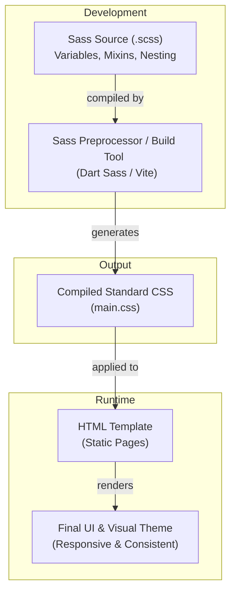

# Sass Compilation Flow

```mermaid
flowchart TD
    subgraph Dev ["Development"]
        SassFiles["Sass Source (.scss) <br/> Variables, Mixins, Nesting"] -->|compiled by| Compiler["Sass Preprocessor / Build Tool <br/> (Dart Sass / Vite)"]
    end

    subgraph Build ["Output"]
        Compiler -->|generates| CSSFile["Compiled Standard CSS <br/> (main.css)"]
    end

    subgraph Browser ["Runtime"]
        CSSFile -->|applied to| HTML["HTML Template <br/> (Static Pages)"]
        HTML -->|renders| Render["Final UI & Visual Theme <br/> (Responsive & Consistent)"]
    end
```
